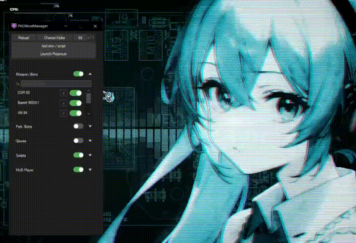
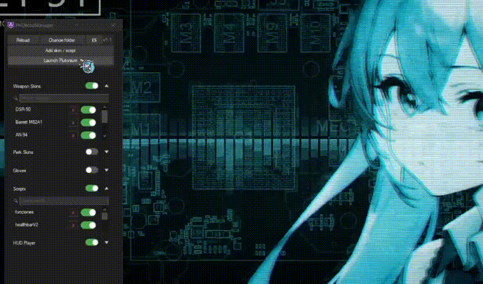
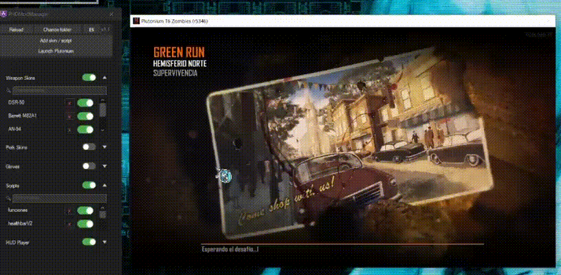

# PHDModManager

  

  

---

## 🇬🇧 English

**PHDModManager** is a launcher/mod manager for **Plutonium (BO2)** that lets you enable and disable mods easily, without manually copying or editing files.

### 📸 Screenshots

  
   
  
  &nbsp;&nbsp;
  

### ✨ Main features

- Enable or disable mods by full category or individually
- Available categories: **Weapon Skins**, **Perk Skins**, **Gloves**, **Scripts**, **HUD Player**
- Search bar within each category to quickly find mods
- Visual HUD position editor (icon and on-screen text)
- Automatic installation of enabled mods into the Plutonium folder
- Built-in dark theme
- Bilingual interface (Spanish / English), with a language toggle button

### 📥 Installation and usage

1. Click here to **[download the latest version](https://github.com/Senju-115/PHDModManager/releases/download/v1.1/PHDModManagerv1.1.zip** (`.zip`)
2. Extract it to a folder of your choice
3. Run `PHDModManager.exe`
4. Enable the mods you want from the interface and press **"Launch Plutonium"**

### 🛠️ For developers

- Clone the repository: `git clone https://github.com/Senju-115/PHDModManager.git`
- Open `PHDModManager.sln` with **Visual Studio**
- Tech stack: **C# WinForms** on **.NET Framework 4.8**
- UI controls (ToggleSwitch, ExpandButton) are custom-built with GDI+, no third-party dependencies

### 📄 License

Creative Commons (no comercial).

---

## 🇪🇸 Español

**PHDModManager** es un launcher/gestor de mods para **Plutonium (BO2)** que permite activar y desactivar mods de forma sencilla, sin tener que copiar o editar archivos manualmente.

### 📸 Capturas de pantalla

  
   
  
  &nbsp;&nbsp;
  

### ✨ Funciones principales

- Activa o desactiva mods por categoría completa o individualmente
- Categorías disponibles: **Weapon Skins**, **Perk Skins**, **Gloves**, **Scripts**, **HUD Player**
- Buscador dentro de cada categoría para encontrar mods rápidamente
- Editor visual de posición del HUD (icono y texto en pantalla)
- Instalación automática de los mods activados hacia la carpeta de Plutonium
- Tema oscuro integrado
- Interfaz bilingüe (español / inglés), con botón para cambiar de idioma

### 📥 Instalación y uso

1. Haz clic aquí para **[descargar la última versión](https://github.com/Senju-115/PHDModManager/releases/download/v1.1/PHDModManagerv1.1.zip)** (`.zip`)
2. Extráelo en la carpeta que prefieras
3. Ejecuta `PHDModManager.exe`
4. Activa los mods que quieras desde la interfaz y presiona **"Launch Plutonium"**

### 🛠️ Para desarrolladores

- Clona el repositorio: `git clone https://github.com/Senju-115/PHDModManager.git`
- Abre `PHDModManager.sln` con **Visual Studio**
- Tecnologías usadas: **C# WinForms** sobre **.NET Framework 4.8**
- Los controles de interfaz (ToggleSwitch, ExpandButton) son personalizados, dibujados con GDI+, sin dependencias de terceros

### 📄 Licencia

Creative Commons (no comercial).

---

